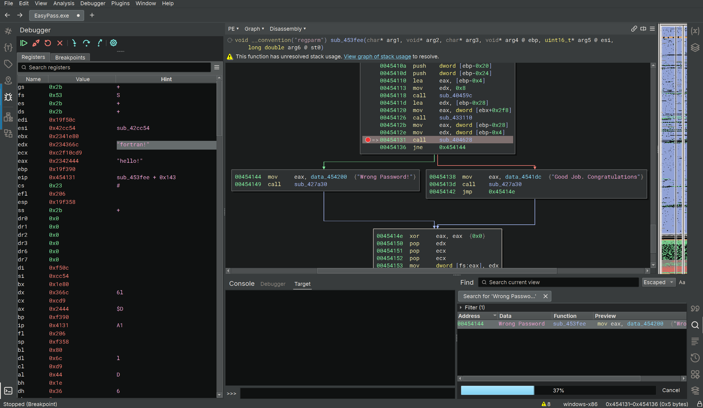

# Easy Pass 
The challenge gives us an executeable file, which is basically a password checker. It will pop up 'Wrong Password!' 
if the password is incorrect. Let's skip the experimenting and jump straight into the binary!

## Code 
Being an executeable file, the binary of the code is massive, so instead of a linear view, we'll take a look at the graph view.
Let's use what we know to orientate ourselves a bit: we can use the search function for 'Wrong Password!' to find where there's 
a checker function for whether the password is right. 

We can find the string 'Wrong Password!' at line 0x454144. If we use the function graph instead of linear view on Binary Ninja, we
can see that there is a branch between this path, and another path which prints "Good Job. Congratulations.": this must be the 
password checker function!

Let's run a breakpoint at 0x454131, just before the branching, and see if we can get any valuee out of the registers using debugger
mode. Running the program, we can see our input stored in the eax register. We can notice another string as well! 'fortran!' is stored
in the edx register - potentially this is our password? Running this string through the checker, we indeed get the "Congratulations" message!
This gives us our flag.

## My Takeaways
I learnt a lot about using Binary Ninja from this challenge. Rather than just finding the main function as usual and reading the code,
I utilised the map feature to understand the branched code better, and also the search feature to orientate myself in the code. Also from
digging around, I found that Binary Ninja had a debugging mode that allowed me to set breakpoints and run the program, which I was able to
utilise for this exercise. The debugging mode also let me peek inside of registers, which ultimately got me the passcode for this exercise. 